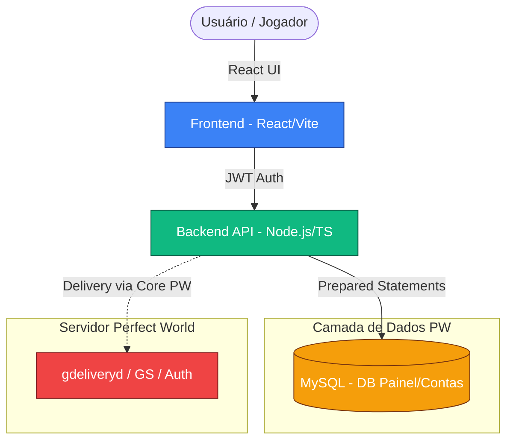

<div align="center">


# 🌌 Painel Perfect World v1.6.2
### A Modern, Robust, and Secure Management Suite for PW Servers

[](https://www.typescriptlang.org/)
[](https://reactjs.org/)
[](https://nodejs.org/)
[](https://tailwindcss.com/)
[](https://www.docker.com/)

---


> [!WARNING]
> **Aguardando Padronização Antigravity**: Este projeto deve ser migrado para arquitetura "Docker Dev / Native Prod".
> Consulte: `.agent/PROJECT_STATUS.md` e a tarefa associada.

---

**Painel PW 162** é uma solução completa de ecossistema para servidores de Perfect World, focada em segurança, performance e experiência do usuário (UX). Desenvolvido com as tecnologias mais modernas do mercado, o painel oferece uma interface intuitiva tanto para jogadores quanto para administradores, sem comprometer a integridade dos dados originais do jogo.

[Explorar Features](#-principais-recursos) • [Arquitetura](#-arquitetura-do-projeto) • [Guia de Instalação](#-guia-de-instalação-quickstart) • [Stack](#-stack-tecnológica)

</div>

## 🎯 Objetivo do Projeto

O objetivo central é fornecer um **Painel Web moderno (User + ADM)** totalmente integrado ao core do **Perfect World 162**, respeitando a separação rigorosa entre camadas:
- **Camada de Dados**: MySQL isolado para contas, painel e sistema de doação.
- **Camada de Jogo**: Integração via `gdeliveryd` e leitura controlada de bancos PW.
- **Segurança**: Zero edição direta de BLOBs perigosos e escrita controlada para evitar corrupção de personagens.

---

## 🧱 Visão Geral da Arquitetura



---

## ✨ Principais Recursos

### 👤 Área do Jogador (Premium UI)
- **Dashboard Glassmorphism**: Visão geral com estilo futurista e red-glass effects.
- **Logo Premium**: Integração de logo com fundo transparente para design limpo.
- **Gestão de Personagens**: Cards interativos com ícones de classe, função de **Teleporte de Emergência** e fallback inteligente de personagens.
- **Saldo & Status**: Visualização de GOLD e status do servidor em tempo real (com sistema de fallback "WOW" fator).
- **Loja de Gold & Histórico**: Interface de compra de pacotes com bônus e aba dedicada ao histórico de transações.
- **Segurança**: Fluxo de autenticação JWT e registro integrado.

### 🛡️ Portal Administrativo (Central de Controle)
- **Dashboard Admin**: Visão consolidada de jogadores online, faturamento e saúde do servidor.
- **Monitor de Processos**: Status em tempo real dos serviços core (`gauthd`, `gamedbd`, etc) com mocks de alta disponibilidade.
- **Gestão de Energia**: Botões para inicializar (`Start`) ou desligar (`Shutdown`) o servidor com segurança.
- **Player Manager Avançado**: Busca global, visualização de personagens e controle de punições/suporte.
- **Controle de Mapas**: Interface para visualizar e gerenciar IDs de instâncias ativas.

---

## 🏗️ Arquitetura de Software

O projeto utiliza padrões de design de nível enterprise para garantir robustez:

- **Repository Pattern**: Camada isolada para todas as interações com o banco de dados.
- **Service Pattern**: Lógica de negócios desacoplada dos controllers, facilitando manutenção.
- **Modular Design**: Divisão clara entre Auth, Character, Server e Donate.

---

## 🧰 Stack Tecnológica Padronizada

### 🔹 Backend (API Engine)
- **Runtime**: Node.js 20 LTS
- **Language**: TypeScript (Strict)
- **Patterns**: Repository & Service
- **Auth**: JWT (Stateless)
- **Logging**: Winston Professional

### 🔹 Frontend (High-End UI)
- **Core**: React 19 & Vite
- **Styling**: Tailwind CSS (Custom Red Brand)
- **Animations**: Framer Motion
- **Icons**: Lucide React

### 🔹 Infraestrutura
- **Deployment**: Execução nativa (Node.js 20+)
- **Orquestração**: PM2 para processos em Node.js (Ambiente de Produção)
- **Proxy**: Nginx (Configuração futura)
*Nota: Docker e WSL estão desabilitados temporariamente por limitações de ambiente.*

---

## 📁 Estrutura de Pastas

```bash
painel-162/
├── backend/            # API Core (Node.js + TS)
├── frontend/           # Interface (React 19 + Vite)
├── scripts/            # Integração e automação do servidor
└── README.md           # Central de Informações
```

---

## 🚀 Guia de Início Rápido (Nativo)

### 1. Instalar Dependências
```bash
# Backend
cd backend && npm install

# Frontend
cd frontend && npm install
```

### 2. Configurar Variáveis de Ambiente
Renomeie `.env.example` para `.env` em ambas as pastas.

### 3. Modo Desenvolvimento
```bash
# Terminal 1: Backend
npm run dev (dentro da pasta backend)

# Terminal 2: Frontend
npm run dev (dentro da pasta frontend)
```

---

## ⚠️ Regras de Ouro (Segurança PW)
1. **Nunca editar BLOBs manualmente**: Manipulação direta pode corromper a database r_roles.
2. **Escrita Indireta**: O painel utiliza o sistema de delivery nativo para evitar conflitos de salvamento do jogo.
3. **Auditoria**: Toda ação administrativa gera um rastro imutável de logs.

---

<div align="center">

Desenvolvido com ❤️ pela comunidade **Antigravity**
_Transformando a gestão de Perfect World para a nova era._

</div>
